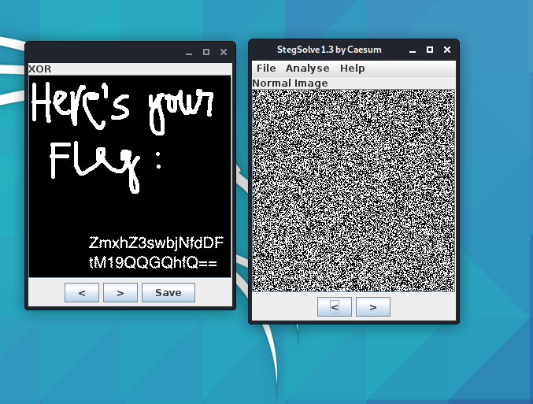

### Crypto

#### Perfect Secrecy

A beginner challenge focuses on forensics rather cryptography.  Two images were given and we needed to retrieve the flag based on those. With the challenge involving images, we always check them with stenography tools as the flag can be hidden inside the image. We used `stegsolve` - a common stegnography tool used in CTFs to combine two images. The first image is loaded into stegsolve, and then `Analyse > Combiner` to fetch the second image. The result shows immediately after combining. It turned out that stegsove used XOR bitwise operation on the images to get the flag.

